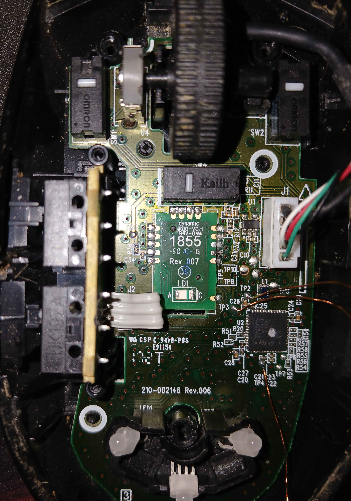

# g102-custom-fw

Custom firmware for the Logitech G102 LIGHTSYNC — a drop-in replacement
for the stock firmware on the STM32F072CB MCU inside the G102/G203.

Everything was written from scratch on top of libopencm3: the HID mouse
service, the quadrature encoder, the "1855" optical sensor driver, the
10-bit BCM RGB lighting stack, and the USB DFU bootloader that sits in
the first 16 KB of flash so the rest of it can be reflashed over USB.



---

## Status

| Subsystem | State |
| --- | --- |
| USB HID boot-mouse (5 buttons + wheel) | working |
| Scroll encoder (Gray-code quadrature, ×4 decode) | working |
| "1855" optical sensor (motion + DPI) | working — axis remap in firmware |
| 3× RGB LEDs (10-bit BCM, ~195 Hz, gamma² breathing) | working |
| USB DFU 1.1 bootloader (`dfu-util`-compatible) | working |
| 3 s DPI long-press to jump into DFU from user firmware | working |
| Forward side-macro to boot firmware out of DFU | working |

Not yet done: 12-bit motion accumulation, per-LED colour profiles
persisted in flash, onboard DPI cycling, scroll acceleration.

---

## Hardware

- **MCU** — STM32F072CB (Cortex-M0, 48 MHz from HSI48, 128 KB flash, 16 KB SRAM).
- **Sensor** — chip marked `1855 Rev 007`, Logitech in-house, likely a
  revision of the Mercury family. Driven over SPI1 mode 3 at ~1.5 MHz
  with a soft CS on PA15. No public datasheet exists; see
  [`docs/SENSOR_1855.md`](docs/SENSOR_1855.md) for the register map and
  init protocol as reconstructed from scope captures.
- **RGB** — 3 common-anode LEDs, 9 low-side-switched cathodes. HIGH = lit.
- **Buttons** — LMB/RMB/MMB + DPI + two side-macro buttons, all active-low
  with internal pull-ups.

Full continuity-traced pinout lives in
[`docs/G102_BOARD.md`](docs/G102_BOARD.md) and mirrors
[`common/board.h`](common/board.h) / [`common/board.hpp`](common/board.hpp).

---

## Flash layout

```
  0x08000000 ────────────── bootloader (16 KB) ──────────
  0x08004000 ────────────── firmware   (112 KB) ─────────
  0x08020000 ────────────── (end of internal flash) ─────
```

The bootloader protects itself: flash writes below `0x08004000` are
rejected. It stays in DFU on any of:

1. `BOOT_MAGIC_ADDR` holds the handoff value at reset (firmware requested
   a reflash),
2. the DPI button is held at reset (physical override),
3. the firmware vector table at `0x08004000` looks invalid
   (pristine chip / bad flash).

The magic slot lives at `0x20003FFC` — the last word of SRAM, excluded
from both linker scripts' `ram` region so neither the initial MSP nor
`.bss` clears it between reset and bootloader entry.

---

## Build

Requires PlatformIO.

```bash
pio run                      # default: bootloader
pio run -e firmware          # firmware
pio run -e bootloader -e firmware   # both
```

Outputs land under `.pio/build/<env>/firmware.{elf,bin}`.

## Flash

Two helper scripts live under [`scripts/`](scripts/):

- [`flash_bootloader.sh`](scripts/flash_bootloader.sh) — OpenOCD + ST-Link,
  one-time via SWD.
- [`flash_firmware.sh`](scripts/flash_firmware.sh) — builds firmware and
  pushes it over USB DFU.

### First time (stock firmware → custom) — SWD via ST-Link

> **Warning — one-way trip.** The stock G102 is shipped with **RDP Level 1**
> and write-protection on the first flash pages. Unlocking it triggers a
> hardware mass-erase, and the original Logitech firmware is **gone for
> good** — it cannot be read out, backed up, or restored afterwards.
> Going through with this step means committing to custom firmware.

**SWD test points.** There's no pre-populated header; you'll be
soldering / pogo-pinning to three pads on the bottom-side of the PCB:

| Signal | Test point |
| --- | --- |
| SWCLK | `TP3` |
| SWDIO | `TP2` |
| NRST | `TP4` |
| GND | any ground pad / USB shield |

Power the board from USB during the session — don't source 3V3 from the
ST-Link. **Tie ST-Link GND to the board GND** even though you're not
sharing 3V3: SWD signals are referenced to ground, and without a common
reference the link either won't enumerate or reads garbage.

**BOOT0 pin.** On this PCB `BOOT0` is tied low through `R20`. The stock
firmware leaves SWD in a state where you can't get a clean halt at reset
— you need to boot into the STM32 system-memory bootloader instead.
Lift BOOT0 by shorting it to 3V3 (a wire with a 1–10 kΩ resistor to VCC
works). **Keep it tied high for the entire SWD session** — releasing it
drops the system bootloader and SWD loses the target.

**Procedure.**

1. Solder/hold the three SWD wires, the ST-Link GND wire, and the
   BOOT0→3V3 wire.
2. Plug the mouse into USB (powers the 3V3 rail).
3. Unlock RDP — this mass-erases flash and drops RDP to Level 0:

    ```bash
    openocd -f interface/stlink.cfg -c 'transport select hla_swd' \
            -f target/stm32f0x.cfg \
            -c 'init; reset halt; stm32f0x unlock 0; reset halt; exit'
    ```

4. Clear the WRP bits on the first flash sector block (this sticks even
   after RDP=0 on some parts):

    ```bash
    openocd -f interface/stlink.cfg -c 'transport select hla_swd' \
            -f target/stm32f0x.cfg \
            -c 'init; reset halt; flash protect 0 0 15 off; sleep 500; exit'
    ```

5. Build and flash the bootloader:

    ```bash
    pio run -e bootloader
    ./scripts/flash_bootloader.sh
    ```

6. Power-cycle the mouse (unplug USB) so the option-byte changes latch,
   then release BOOT0 and unplug SWD. Replug USB — the bootloader
   should be live. Hold DPI during plug-in to confirm you land in DFU
   (LEDs cycle at 1/4 brightness). Then flash the firmware via DFU
   (next section).

### After that — DFU over USB

1. Plug the mouse in while holding DPI, **or** hold DPI for 3 seconds in
   the running firmware.
2. Mouse enumerates as `0483:df11` and cycles LED1 → LED2 → LED3 at 1/4
   brightness so you know you're in DFU.
3. Flash:

    ```bash
    ./scripts/flash_firmware.sh
    ```

   The bootloader auto-resets into the newly flashed firmware as soon as
   `dfu-util` finishes — no replug needed. The **forward** side-macro
   button is a manual override if you want to leave DFU without
   flashing.

---

## Legal

This is an independent reverse-engineering project. Not affiliated with,
endorsed by, or connected to Logitech.

- The original code in this repository is released under the MIT License
  (see [`LICENSE.md`](LICENSE.md)).
- [`firmware/src/sensor_frames.h`](firmware/src/sensor_frames.h) and the
  contents of [`captures/`](captures/) (raw logic-analyzer trace, its
  disassembly, and `srom_verified_1020.bin` — the SROM payload observed
  on the wire) are byte-for-byte recordings of SPI transactions captured
  from the stock firmware's sensor bus with a logic analyzer. They are
  included here for interoperability and reproducibility only. No stock
  firmware binary was decompiled, dumped, or included in this repository.
- Uses Logitech's VID/PID (`046D:C092`) so the device enumerates as a
  drop-in replacement for the stock G102/G203. Not a USB-IF certified
  product; for personal and research use only.
- Links against [libopencm3](https://libopencm3.org/) (LGPL-3.0-or-later).

"Logitech", "G102", "G203", and "LIGHTSYNC" are trademarks of Logitech
International S.A., used for identification only.

**No warranty.** Flashing custom firmware can brick your mouse. You
are responsible for anything you do with this code.
